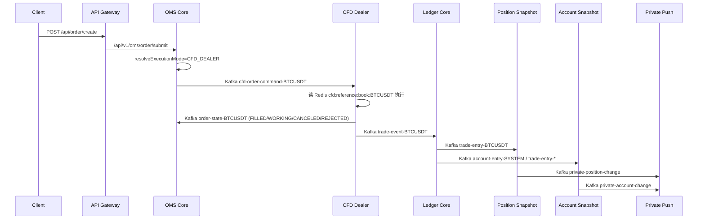

# CFD 模式实施任务单 V2

> 更新时间：2026-03-01  
> 目标：基于当前代码现状，明确 CFD 下单与成交闭环、PNL 推送闭环、强平闭环的真实链路与缺口，并给出可落地的整改批次。  
> 范围：`BTCUSDT` 优先，执行模式 `CFD_DEALER`，不对冲（平台做对手方）。

---

## 0. 结论先行（回答核心问题）

### 0.1 现在下单链路是什么？

在 **CFD 模式** 下，用户下单主链路是：

`api-gateway -> oms-core -> Kafka(cfd-order-command-{symbol}) -> cfd-dealer-core -> Kafka(order-state-{symbol}, trade-event-{symbol}) -> oms-core + ledger-core -> trade-entry/account-entry -> snapshot -> private-push`

即：`api-gateway -> oms-core -> cfd-dealer-core（通过 Kafka）`，不是 match-engine。

### 0.2 架构面是否合理？

**方向合理，但双栈并存导致关键闭环不一致。**

合理点：
1. CFD 成交执行已从 Match 解耦，改为 Dealer + Binance 参考簿。
2. 成交后继续复用 `ledger -> snapshot -> push` 既有账务链路，降低重构面。
3. OMS 具备按 `executionMode/symbol` 路由能力，可 CFD 与 MATCH 并存。

主要问题：
1. 强平下单仍走 `MATCH_ENGINE` 路径，不走 CFD Dealer，和当前主执行架构不一致。
2. 强平保险基金调用契约未闭合（Feign 服务名/接口路径与现有服务实现不对齐）。
3. 主题命名与风险触发路径存在“新旧并存”，运维与排障复杂度偏高。

### 0.3 下单链路是否正确、逻辑是否完备？

**普通用户下单：基本正确，逻辑大体完备（可用级）。**  
**强平下单：未完备（生产风险高）。**

### 0.4 下单成交、PNL 推送是否完备？

**成交 + 账本 + 持仓/账户推送主闭环已打通，但仍是“部分完备”。**  
主要缺口在 topic/契约统一、推送可靠性细节和风控触发主路径收敛。

### 0.5 强平是否完备？

**不完备。**  
核心原因不是“没有代码”，而是“关键路径未闭合/未统一到 CFD 执行架构”。

---

## 1. As-Is 真实链路（按场景）

## 1.1 用户下单（CFD 模式）

## 1.2 用户下单（非 CFD 或显式 MATCH）

`api-gateway -> oms-core -> Kafka(order-event-{symbol}) -> match-engine-core -> order-state/trade-event -> 后续账务链路`

## 1.3 强平下单（当前实现）

`margin-mode-core -> liquidation-trigger-topic -> liquidation-core -> Feign(oms-core /internal/order/createLiquidation) -> OrderServiceImpl.createLiquidationOrder(executionMode=MATCH_ENGINE) -> match-engine-core`

这条链路 **没有接入 CFD Dealer**，与 CFD 主路径不一致。

---

## 2. 完备性评估（V2 基线）

| 评估项 | 结论 | 说明 |
|---|---|---|
| 下单入口与路由（普通单） | PASS | Gateway 到 OMS 路由正常；OMS 可按 `CFD_DEALER/MATCH_ENGINE` 分流；CFD 指令进入 `cfd-order-command-*`。 |
| 成交与订单状态闭环 | PASS- | Dealer 能发 `trade-event-{symbol}` + `order-state-{symbol}`；OMS 订单状态回写可用。 |
| 账本闭环（平台对手方） | PASS- | Ledger 已支持 `trade-event.*`，并校验 `dealerAccountId` 归属。 |
| PNL 与私有推送闭环 | PARTIAL | `trade-entry -> position/account -> private push` 已通；但推送可靠性与主题统一仍有缺口。 |
| 强平闭环 | PARTIAL/FAIL | 触发、监听、成交后处理框架在；但下单仍走 MATCH、保险基金契约未闭、重试/手动存在 TODO。 |

---

## 3. 关键差距清单（按优先级）

## 3.1 P0（必须先修）

### P0-1 强平订单执行路径未对齐 CFD

现状：
1. `liquidation-core` 调 OMS 内部接口创建强平单。
2. OMS `OrderServiceImpl.createLiquidationOrder()` 写死 `executionMode = MATCH_ENGINE` 并直接提交 Match。

风险：
1. CFD 模式主流动性来自 Binance 参考簿 + Dealer，本地 Match 可能无法提供可成交对手，强平可能超时/失败。
2. 强平与普通单执行语义不一致，导致风险控制不可预测。

建议：
1. 强平/ADL 统一进入 OMS 新执行路由（复用 `OmsServiceImpl` 的 executionMode 机制）。
2. 对内部订单增加 `executionMode` 入参并允许 `CFD_DEALER`。

### P0-2 保险基金调用契约未闭合

现状：
1. `liquidation-core` 的 `InsuranceFundClient` 声明 `@FeignClient(name="insurance-fund-service", path="/internal/insurance-fund")`。
2. 现有 ADL 服务名为 `adl-core`，且未发现 `/internal/insurance-fund/expense|balance` 对应控制器实现。

风险：
1. 穿仓赔付路径可能运行时直接失败，影响 `remainingLoss/adlRequired` 结果准确性。

建议：
1. 明确“保险基金服务”归属：独立服务或 ADL 子域。
2. 统一服务名、Feign 名称、内部 API 路径并补齐契约测试。

### P0-3 强平失败重试与人工触发未闭环

现状：
1. `manualLiquidation` 未实现（抛 `UnsupportedOperationException`）。
2. `retryLiquidation` 仅更新状态，重建订单逻辑 TODO。
3. `OrderMonitorServiceImpl` 对失败/超时场景有 TODO，未真正触发重试。

风险：
1. 强平故障后无法自动恢复，需人工 SQL 干预。

建议：
1. 补齐“失败->重试->告警->人工介入”状态机。
2. 形成可观测指标与补偿脚本。

## 3.2 P1（应在 V2 收敛）

### P1-1 Topic 命名和兼容层混用

现状：
1. 同时存在 `trade-event` 与 `trade-event-{symbol}` 语义。
2. `order-state`、`trade-entry`、`mark-price` 也保留了兼容分支/历史命名。

风险：
1. 运维排障复杂，跨服务契约边界模糊。

建议：
1. 发布 V2 “唯一 canonical topic 矩阵”，兼容通道设定明确退役窗口。

### P1-2 风险触发存在并行来源

现状：
1. `position-snapshot-core` 仍发布 `risk-event-topic`。
2. `margin-mode-core` 自行消费标记价并触发 `liquidation-trigger-topic`。

风险：
1. 未来易出现重复触发、阈值不一致、事件语义冲突。

建议：
1. 指定单一强平触发主源（推荐 `margin-mode-core`）。
2. 其余链路降级为观测/告警用途。

### P1-3 OMS 订单状态消费交易对枚举硬编码

现状：
1. `OrderStateConsumer` 订阅列表固定 `BTC/ETH/XRP`。

风险：
1. 新增 symbol 时易遗漏，导致状态不回写。

建议：
1. 改为 `topicPattern` 或配置化 symbols。

## 3.3 P2（治理改进）

### P2-1 配置治理与安全基线

现状：
1. 多个 `nacos-configs/*-dev.yml` 存在本地地址、root 用户、默认密码等开发便捷配置。

风险：
1. 环境漂移与误用风险高，不符合生产配置治理要求。

建议：
1. dev 保留可接受，但需与 prod 配置严格隔离并建立扫描门禁。

---

## 4. CFD V2 实施批次

| 批次 | 目标 | 改造范围 | 验收标准 |
|---|---|---|---|
| V2-C1 | 强平/ADL执行路径统一到 OMS 执行路由 | `liquidation-core`, `oms-core` | 强平创建单可配置 `executionMode=CFD_DEALER`，Kafka 命中 `cfd-order-command-{symbol}`。 |
| V2-C2 | 保险基金服务契约闭环 | `liquidation-core`, `adl-core`(或独立服务) | `expense/balance` API 可调，服务名与 Nacos 注册一致，契约测试通过。 |
| V2-C3 | 强平状态机闭环（重试/人工） | `liquidation-core` | 失败、超时、部分成交、人工触发四类流程可演练并有状态迁移记录。 |
| V2-C4 | Topic 契约统一与退役计划 | `init_kafka.sh`, 各消费端配置 | 发布 canonical topic 矩阵；兼容 topic 有明确退役日期和迁移开关。 |
| V2-C5 | 风险触发主路径收敛 | `margin-mode-core`, `position-snapshot-core` | 强平触发单一主源；重复触发率为 0；告警链路独立。 |
| V2-C6 | 推送一致性与可靠性增强 | `snapshot-account-core`, `private-push-core` | account/position 推送均具备异常兜底策略（DLQ 或重试观测）；无静默丢消息。 |
| V2-C7 | 配置与服务名治理 | `nacos-configs/*`, 启动配置 | 禁止生产配置中的 root/默认密码/硬编码地址；服务名清单一致。 |
| V2-C8 | E2E 回归门禁扩展 | `scripts/cfd/*` | 在 C1~C7 基础上新增强平闭环测试，CI 门禁要求全通过。 |

---

## 5. Canonical Topic 矩阵（V2 建议）

| 主题 | 生产者 | 消费者 | 说明 |
|---|---|---|---|
| `cfd-order-command-{symbol}` | oms-core | cfd-dealer-core | CFD 执行指令 |
| `order-event-{symbol}` | oms-core | match-engine-core | MATCH 执行指令（保留） |
| `order-state-{symbol}` | cfd-dealer-core / match-engine-core | oms-core, liquidation-core | 订单状态回传 |
| `trade-event-{symbol}` | cfd-dealer-core / match-engine-core | ledger-core | 成交事件 |
| `trade-entry-{symbol}` | ledger-core | position-snapshot-core, snapshot-account-core | 账本分录 |
| `account-entry-{scope}` | ledger-core | snapshot-account-core | 系统账务分录 |
| `private-position-change` | position-snapshot-core | snapshot-account-core, private-push-core | 持仓变化 |
| `private-account-change` | snapshot-account-core | private-push-core | 账户变化 |
| `liquidation-trigger-topic` | margin-mode-core | liquidation-core (+adl-core 可选) | 强平触发 |
| `liquidation-completed-topic` | liquidation-core | adl-core | 强平完成 |

说明：
1. `trade-event` 全局旧主题建议仅作为兼容读，不再作为新写入目标。
2. 兼容窗口结束后删除旧 topic 创建/describe 逻辑，避免误读。

---

## 6. 测试与验收清单（V2）

## 6.1 已有脚本（可复用）

1. `scripts/cfd/test_c1_schema_contract.sh`
2. `scripts/cfd/test_c2_reference_book.sh`
3. `scripts/cfd/test_c3_oms_route.sh`
4. `scripts/cfd/test_c4_market_fill.sh`
5. `scripts/cfd/test_c5_limit_trigger.sh`
6. `scripts/cfd/test_c6_ledger_balance.sh`
7. `scripts/cfd/test_c7_push_consistency.sh`

## 6.2 V2 需新增

1. `test_c8_liquidation_cfd_path.sh`
   - 断言强平订单在 CFD 模式命中 `cfd-order-command-{symbol}`。
   - 断言 `order-state` 最终到 `FILLED/FAILED` 且状态机可解释。
2. `test_c9_liquidation_insurance_adl.sh`
   - 构造穿仓场景，验证保险基金扣减、`remainingLoss`、`adlRequired` 与 `liquidation-completed-topic` 一致。
3. `test_c10_retry_manual_liquidation.sh`
   - 验证超时重试、手动触发、幂等防重。

---

## 7. 交付定义（Definition of Done）

满足以下条件，CFD V2 才可判定完成：

1. 普通单与强平单执行路径一致遵循 `executionMode`，CFD 模式不依赖 Match 流动性。
2. 强平失败可自动重试，且支持人工重试/触发接口。
3. 保险基金接口真实可调用，服务发现与接口契约一致。
4. Topic 契约单一、可追溯，兼容层有退役计划。
5. `C1~C10` 全量脚本通过并生成报告。

---

## 8. 本版建议排期

1. 第 1 周：完成 `V2-C1 ~ V2-C3`（先打通强平闭环）。
2. 第 2 周：完成 `V2-C4 ~ V2-C6`（收敛契约和可靠性）。
3. 第 3 周：完成 `V2-C7 ~ V2-C8`（治理与全链路门禁）。

> 备注：若要先上线“仅普通单 CFD”，至少也应先完成 `V2-C1` 与 `V2-C2`，否则极端行情下强平路径风险不可接受。

