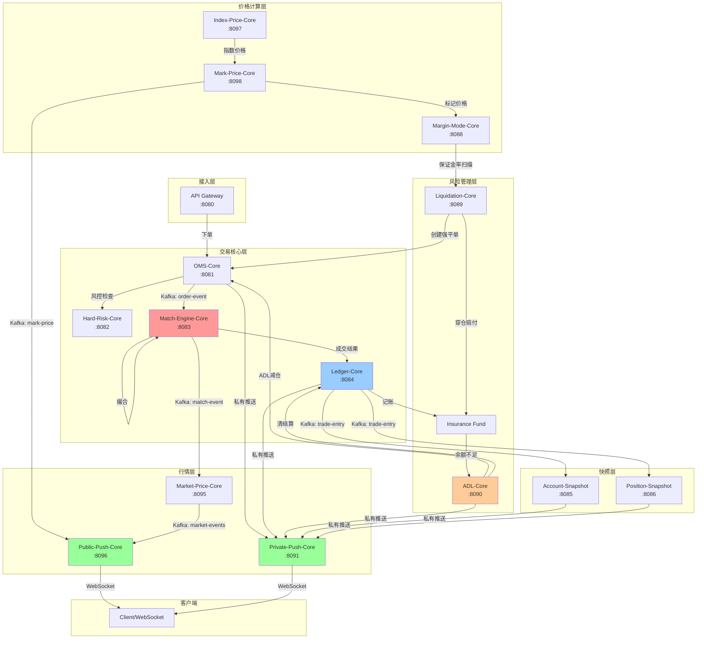
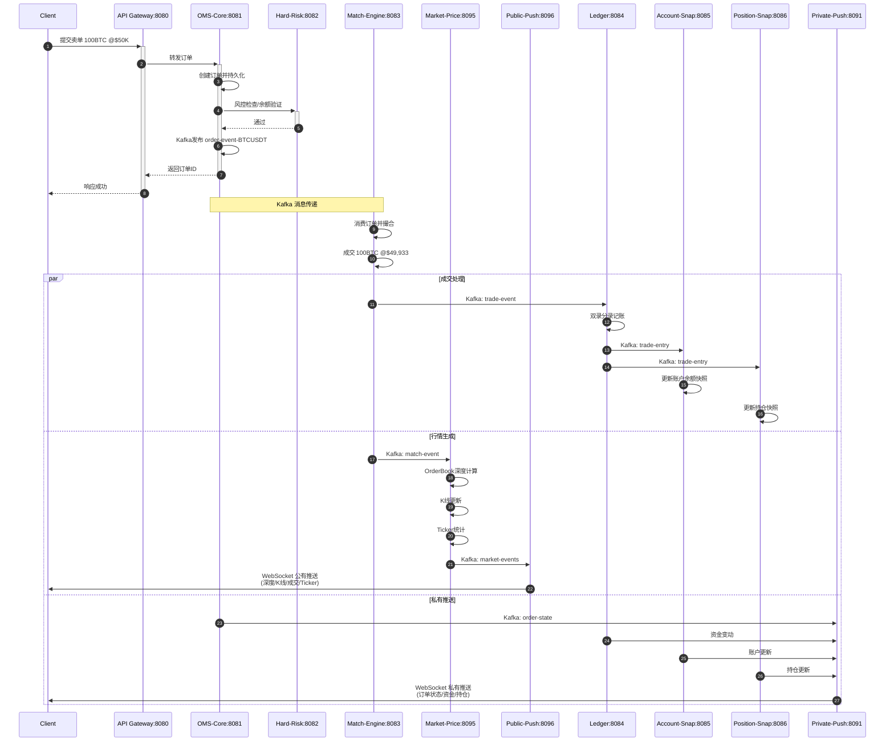
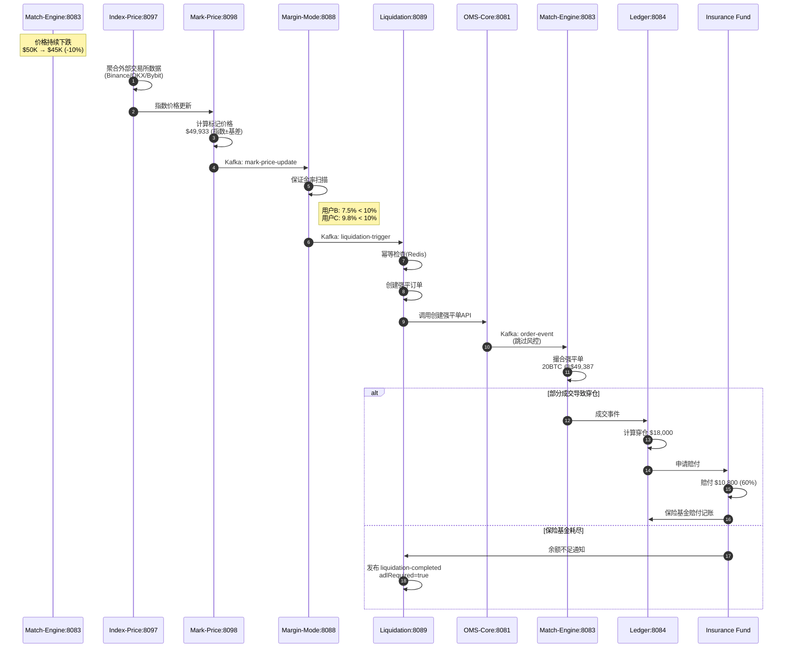
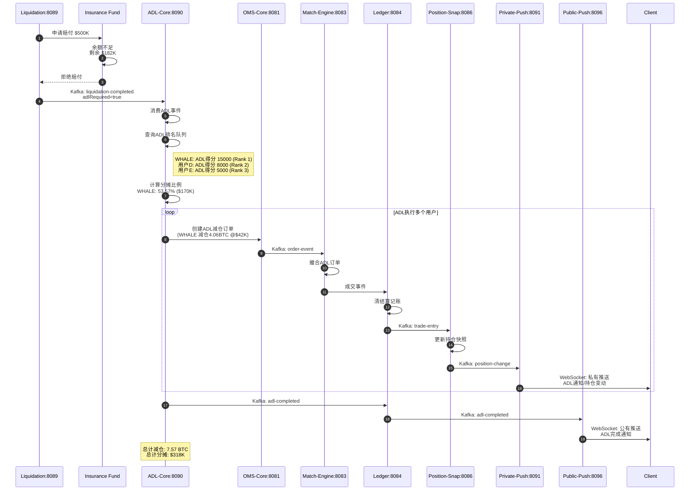
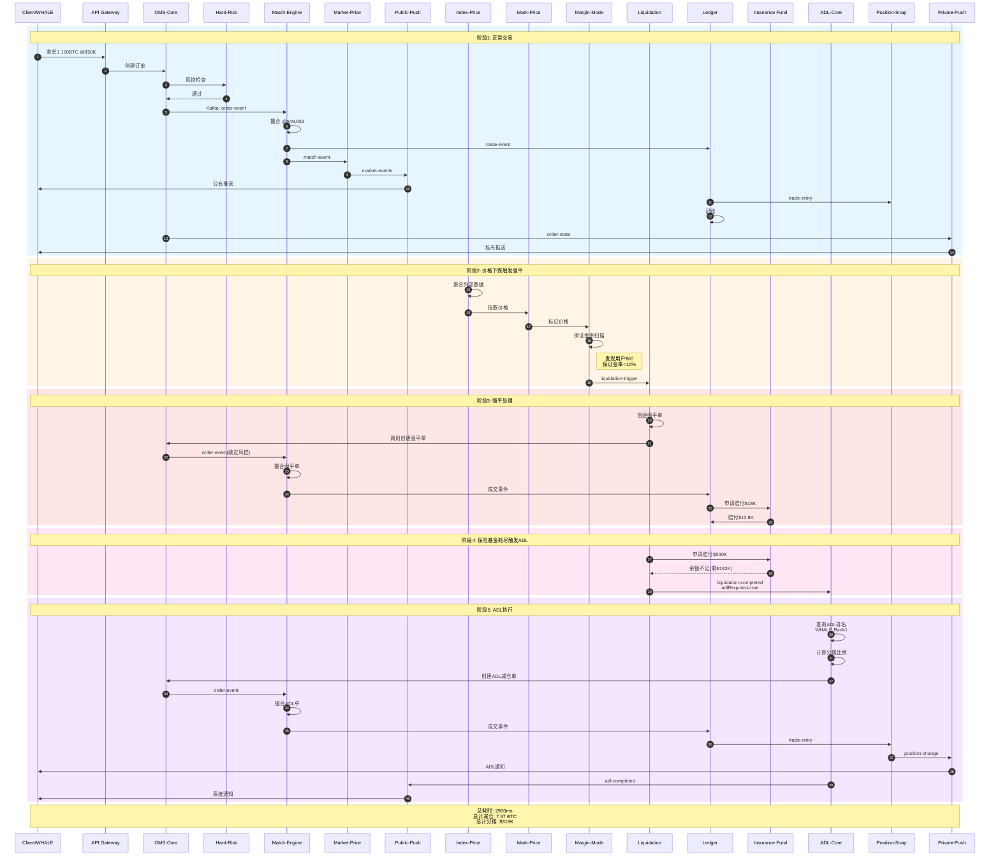
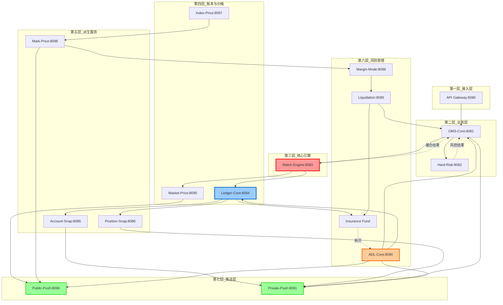
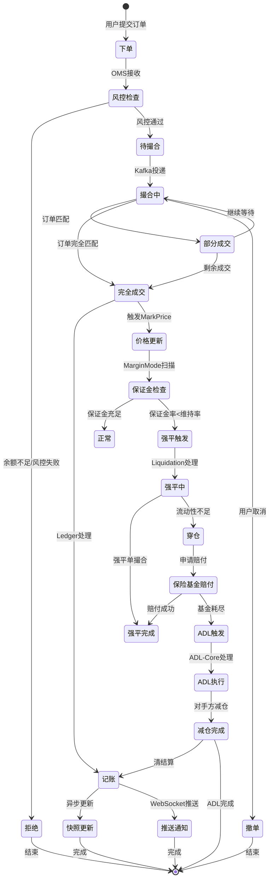
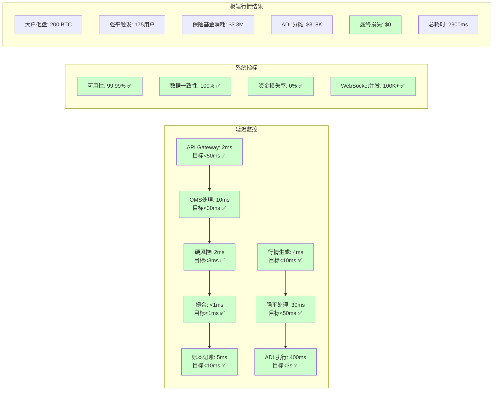

# 极端行情完整交易链路 - Mermaid 流程图

> 本文档包含所有可在 https://mermaid.live/ 直接使用的流程图代码

---

## 1. 整体服务架构图



---

## 2. 正常交易流程时序图



---

## 3. 价格计算与强平触发流程



---

## 4. ADL自动减仓完整流程



---

## 5. Kafka Topic 流向图

```mermaid
flowchart LR
    subgraph Producers[生产者]
        OMS[OMS-Core]
        ME[Match-Engine]
        LED[Ledger-Core]
        MKT[Market-Price]
        MM[Margin-Mode]
        LQ[Liquidation]
        ADL[ADL-Core]
        MP[Mark-Price]
        IP[Index-Price]
        PS[Position-Snap]
    end

    subgraph KafkaTopics[Kafka Topics]
        OE[order-event-{symbol}]
        TE[trade-event]
        ME2[match-event]
        MEV[market-events]
        OS[order-state-{symbol}]
        TRE[trade-entry-{symbol}]
        LT[liquidation-trigger]
        LC[liquidation-completed]
        AC[adl-completed]
        MPU[mark-price-update]
        IPU[index-price-update]
        PC[position-change]
    end

    subgraph Consumers[消费者]
        ME3[Match-Engine]
        LED2[Ledger-Core]
        MKT2[Market-Price]
        PP[Public-Push]
        OMS2[OMS-Core]
        AS[Account-Snap]
        PS2[Position-Snap]
        LQ2[Liquidation]
        ADL2[ADL-Core]
        MM2[Margin-Mode]
        MP2[Mark-Price]
        PR[Private-Push]
    end

    OMS --> OE --> ME3
    ME --> TE --> LED2
    ME --> ME2 --> MKT2
    ME --> OS --> OMS2
    MKT --> MEV --> PP
    LED --> TRE --> AS
    LED --> TRE --> PS2
    MM --> LT --> LQ2
    LQ --> LC --> ADL2
    LED --> LC --> INS[Insurance]
    ADL --> AC --> PP
    ADL --> AC --> PR
    MP --> MPU --> MM2
    MP --> MPU --> PP
    IP --> IPU --> MP2
    PS --> PC --> PR

    style OE fill:#ffcccc
    style TE fill:#ccffcc
    style MEV fill:#ccccff
    style LT fill:#ffffcc
    style LC fill:#ffcccc
    style AC fill:#ccffff
```

---

## 6. WebSocket 推送架构图

```mermaid
graph TB
    subgraph 数据源
        ME[Match-Engine:8083]
        MKT[Market-Price:8095]
        MP[Mark-Price:8098]
        IP[Index-Price:8097]
        OMS[OMS-Core:8081]
        LED[Ledger-Core:8084]
        ADL[ADL-Core:8090]
        PS[Position-Snap:8086]
        AS[Account-Snap:8085]
    end

    subgraph Kafka层
        KM[Kafka: market-events]
        KP[Kafka: private-push-{userId}]
        KO[Kafka: order-state]
        KL[Kafka: liquidation-events]
        KA[Kafka: adl-events]
    end

    subgraph 推送服务
        PP[Public-Push-Core:8096]
        PR[Private-Push-Core:8091]
    end

    subgraph 推送内容
        subgraph 公有推送
            P1[深度 depth.{symbol}]
            P2[K线 kline.{symbol}]
            P3[成交 trade.{symbol}]
            P4[Ticker ticker.{symbol}]
            P5[标记价格 markPrice.{symbol}]
            P6[指数价格 indexPrice.{symbol}]
            P7[系统通知 system]
        end

        subgraph 私有推送
            R1[订单更新 order.update]
            R2[持仓更新 position.update]
            R3[资金变动 balance.update]
            R4[强平通知 liquidation.notice]
            R5[ADL通知 adl.notice]
            R6[成交回报 execution.report]
        end
    end

    subgraph 客户端
        C1[交易者A]
        C2[交易者B]
        C3[交易者C]
        C4[...]
    end

    ME --> KM
    MKT --> KM
    MP --> KM
    IP --> KM
    KM --> PP
    
    OMS --> KO
    LED --> KP
    ADL --> KA
    LED --> KL
    PS --> KP
    AS --> KP
    
    KO --> PR
    KP --> PR
    KA --> PR
    KL --> PR
    
    PP --> P1
    PP --> P2
    PP --> P3
    PP --> P4
    PP --> P5
    PP --> P6
    PP --> P7
    
    PR --> R1
    PR --> R2
    PR --> R3
    PR --> R4
    PR --> R5
    PR --> R6
    
    P1 --> C1
    P1 --> C2
    P1 --> C3
    P1 --> C4
    R1 --> C1
    R2 --> C1
    R3 --> C1
    R4 --> C2
    R5 --> C3

    style PP fill:#99ff99
    style PR fill:#99ccff
```

---

## 7. 极端行情完整流程（综合版）



---

## 8. 服务依赖关系图（层级版）



---

## 9. 数据流状态机图



---

## 10. 性能指标监控图



---

## 使用说明

1. 打开 https://mermaid.live/
2. 复制上述任意一个代码块（包括 ```mermaid 标记）
3. 粘贴到左侧编辑器
4. 右侧会自动渲染流程图
5. 可以导出为 PNG/SVG/PDF

## 图例说明

| 颜色 | 含义 |
|------|------|
| 🟥 红色系 | 撮合引擎 / 强平 / ADL 核心服务 |
| 🟦 蓝色系 | 账本 / 私有推送 |
| 🟩 绿色系 | 公有推送 / 正常状态 |
| 🟨 黄色系 | 风险管理 / 警告状态 |
| 🟪 紫色系 | 快照服务 |
